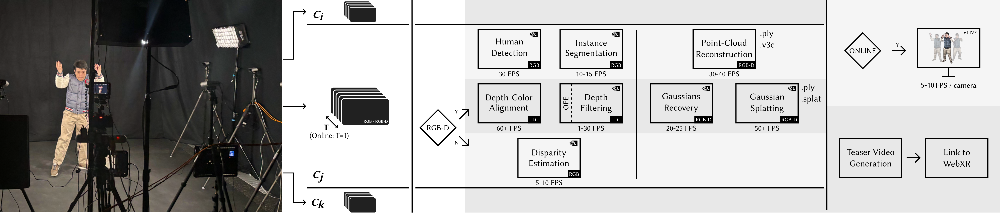
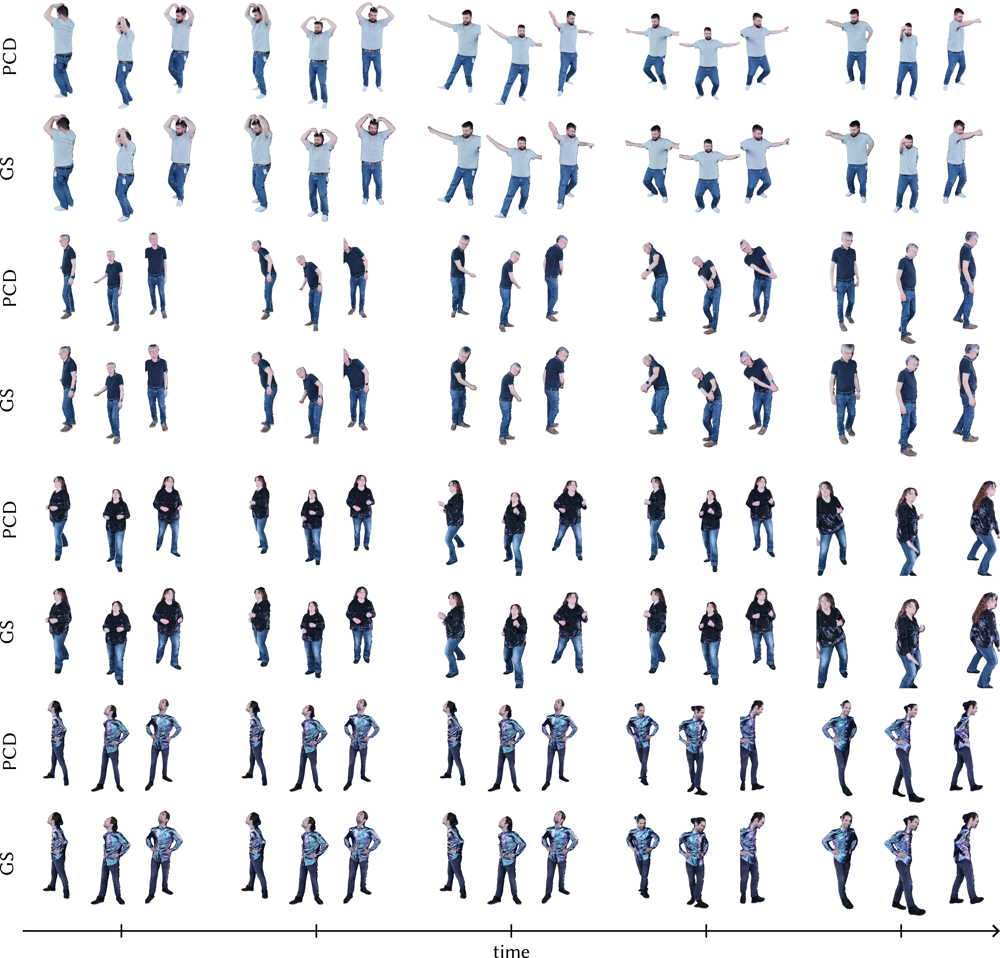

## Pipeline



## Results

### Images

+ Comparison between point cloud data (PCD) and Gaussian splats (GS)



### Videos

*Coming soon...*

## Code

*Coming soon...*

## Citation

```bibtex
@inproceedings{charisoudis2025vv,
  title={A Fast Volumetric Capture and Reconstruction Pipeline for Dynamic Point Clouds and Gaussian Splats},
  author={Charisoudis, Athanasios and Croci, Simone and Lam, Kit Yung and Frossard, Pascal and Smolic, Aljosa},
  booktitle={Proceedings of the 22nd ACM SIGGRAPH European Conference on Visual Media Production (CVMP)},
  year={2025}
}
```
